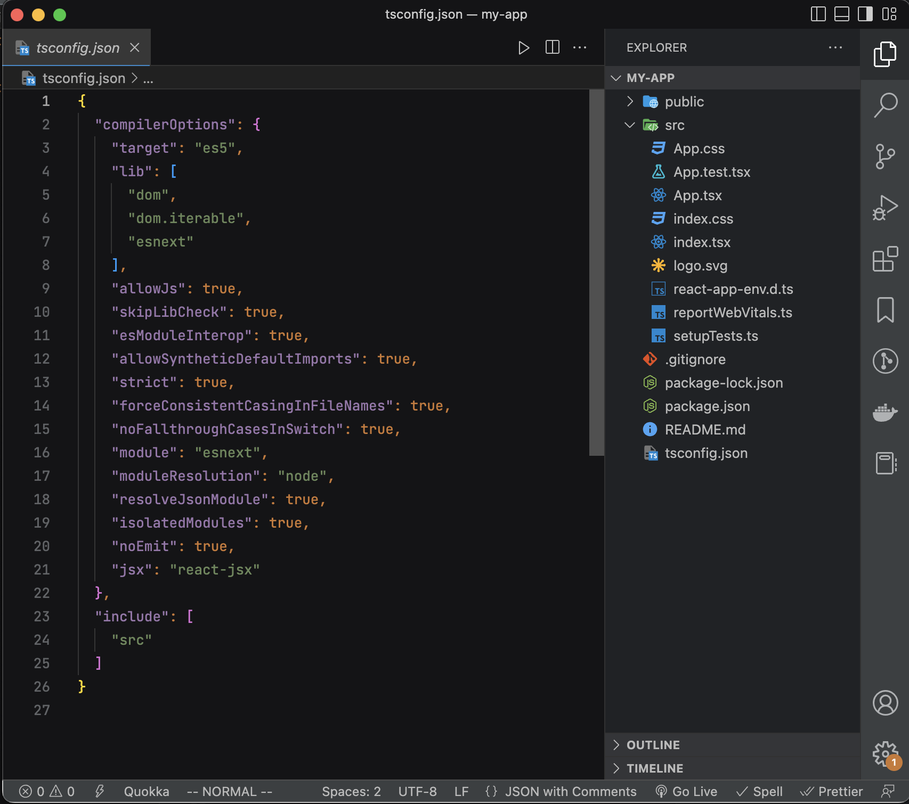
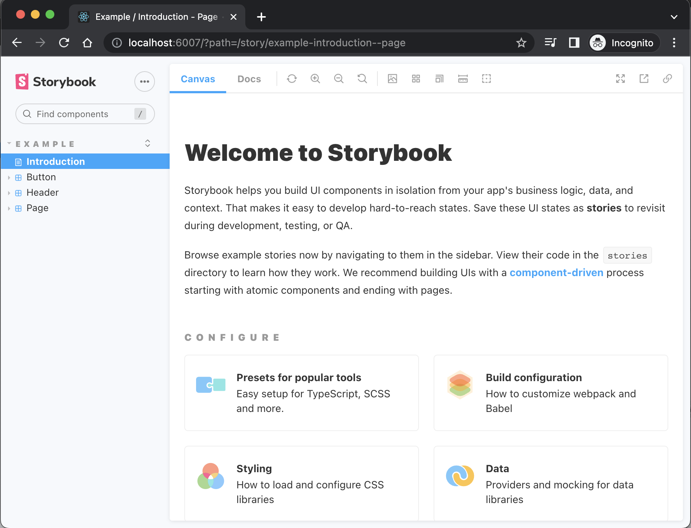

Storybook is by far one of the best tools to build components in an isolated manner without the need of external dependencies. Together combined with Typescript and React Testing Library we can leverage a powerful development workflow. Let's go through the steps to setup it up.

<!-- truncate  -->

## Install React & Typescript

Possibly, the most feasible way to install Typescript and React is to run:

```bash
npx create-react-app <MY_APP> --template typescript
```

This will scaffold a React project with the necessary dependencies to support Typescript:


## Install Storybook

As per [Storybook](https://storybook.js.org/docs/react/get-started/install) docs, it is not made for empty projects, you must have a project already bootstrapped with a framework. Run the following in your root directory:

```bash
npx storybook init
```

this will install the necessary dependencies, setup scripts to run and build Storybook, and create boilerplate stories.
To verify this is working correctly, firstly, build your app and run the following command:

```bash
npm run storybook
```


If it builds successfully you will be greeted with a welcome message. Now you can use Typescript to build Stories. Next, let's setup Webpack.

## Install Webpack

In your root directory run the following command to install `webpack` and the `webpack-cli`:

:::caution

The minimum supported Node.js version to run Webpack 5 is 10.13.0 (LTS)

:::

```bash
npm install webpack webpack-cli --save-dev
```

### Config setup

Now let's create a basic Webpack config file.
